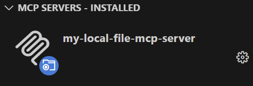

# local-file-mcp-server
A simple mcp server to serve local files


## Development getting started

This project uses `uv`, a better and faster python package manager.
Install it according to this [documentation](https://docs.astral.sh/uv/getting-started/installation).

### Prepare dev environment
Create venv and install all dependencies defined in `pyproject.toml`:
```
uv sync --all-groups
```

### Run server locally
```
uv run main.py
```

### Add MCP server to vscode
1. Press `CTR + SHIFT + P`, select 'MCP: Add server'
2. Select 'Command'
3. As Command, type in: 'uv --directory "/ABSOLUTE/PATH/TO/REPOS/FOLDER/" run main.py'
4. Enter Server ID, i.e. 'my-local-file-mcp-server'
5. The mcp server should show under 'MCP Servers - Installed' area:
